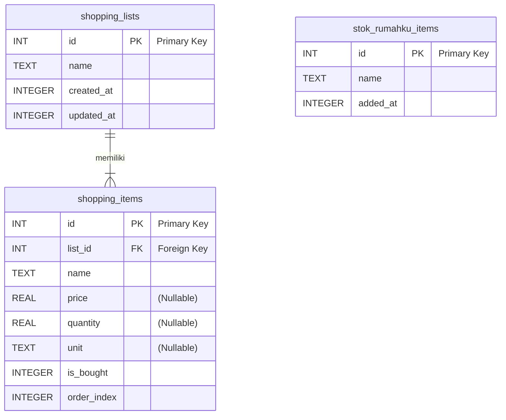

### Entity-Relationship Diagram (ERD) - Aplikasi Daftar Belanjaku

#### Legenda Notasi (Crow's Foot Notation)

*   `PK`: Primary Key (Kunci Utama)
*   `FK`: Foreign Key (Kunci Asing)
*   `|` : Menandakan "Satu" (One)
*   `<` : Menandakan "Banyak" (Many)
*   `o` : Menandakan "Opsional" (Zero or...)
*   `||`: Menandakan "Satu dan Hanya Satu" (One and Only One)
*   `|<`: Menandakan "Satu atau Banyak" (One or Many)

---

#### Diagram

Diagram ini menunjukkan dua kelompok hubungan utama:
1.  **Daftar Belanja & Itemnya:** Hubungan antara `shopping_lists` dan `shopping_items`.
2.  **Template & Item Presetnya:** Hubungan antara `item_categories` dan `preset_items`.

---

#### Penjelasan Hubungan

1.  **`shopping_lists` dan `shopping_items`**
    *   **Jenis Hubungan:** Satu-ke-Banyak (*One-to-Many*)
    *   **Deskripsi:**
        *   Satu `shopping_list` dapat memiliki **satu atau banyak** `shopping_items`.
        *   Setiap `shopping_item` harus terhubung ke **satu dan hanya satu** `shopping_list`.
    *   **Implementasi Teknis:** Hubungan ini diimplementasikan melalui *foreign key* `list_id` di tabel `shopping_items` yang merujuk ke `id` di tabel `shopping_lists`. Jika sebuah `shopping_list` dihapus, semua `shopping_items` yang terkait dengannya juga akan dihapus (karena ada *constraint* `ON DELETE CASCADE`).
